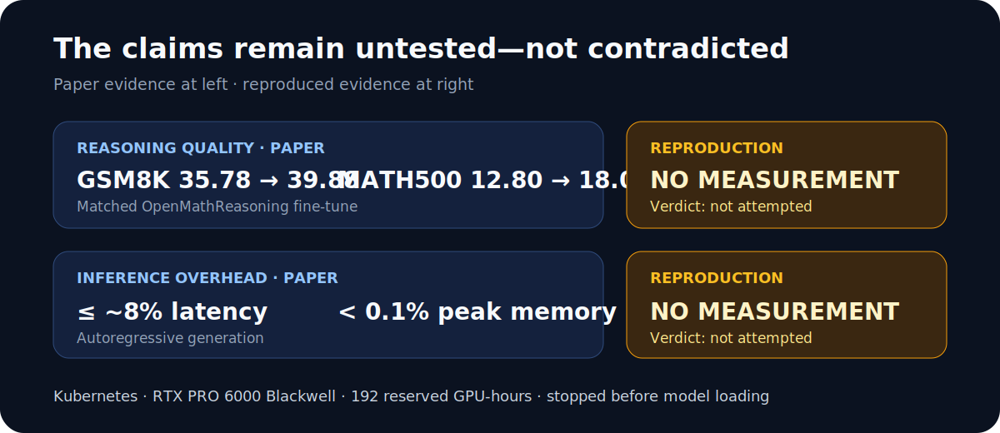
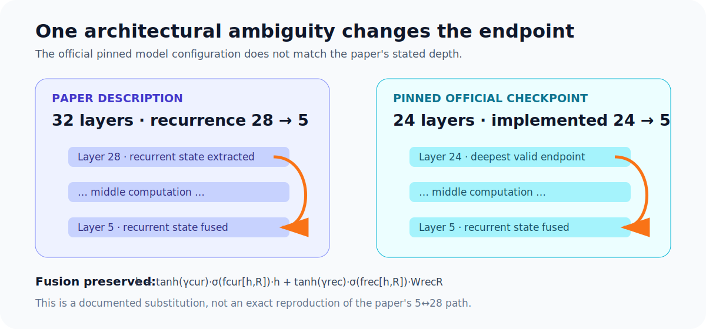
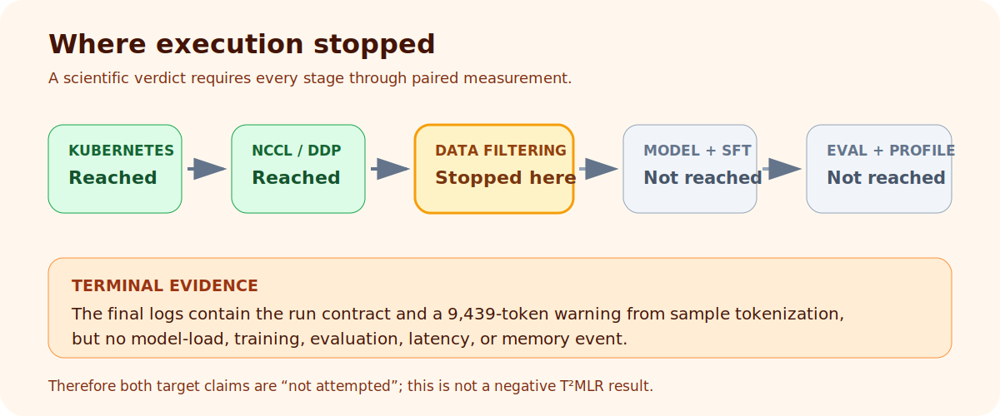
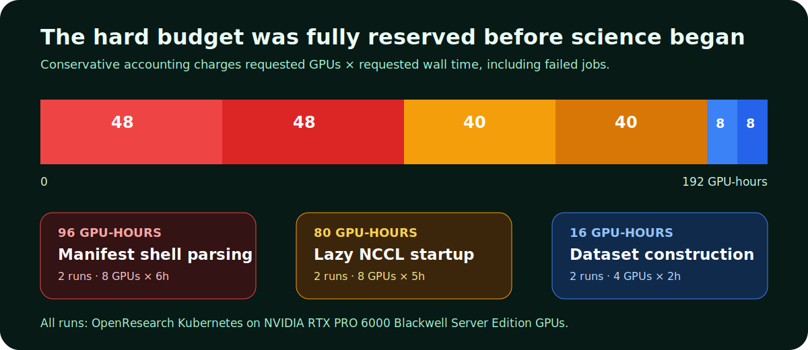

# T²MLR retrofit reproduction: blocked before the scientific comparison



*Strongest result first: there is no scientific result to compare. The paper reports sizable reasoning gains and small inference overhead, but this bounded Kubernetes reproduction exhausted its 192 reserved GPU-hour allowance in setup and data construction. Treating that as evidence against T²MLR would be incorrect.*

Can a pretrained 1.7B Transformer gain mathematical reasoning ability from a small recurrent path between its middle layers—without paying much at inference time? T²MLR answers yes. We implemented the proposed gated path, designed a matched baseline/T²MLR pair, and attempted the comparison on OpenResearch Kubernetes. Execution never reached model loading, fine-tuning, evaluation, or profiling, so both requested claims are **not attempted**.

## Verdict at a glance

| Target claim | Paper evidence | Reproduced evidence | Verdict | Compute charged |
|---|---:|---:|---|---:|
| A recurrent retrofit improves an identically fine-tuned SmolLM2-1.7B-Instruct baseline | GSM8K 35.78→39.88; MATH500 12.80→18.00 | No paired accuracy was emitted | **Not attempted** | 192 GPU-hours across all attempts |
| The recurrent path costs at most about 8% generation latency and less than 0.1% peak inference memory | ≤~8% latency; <0.1% memory | No latency or memory event was emitted | **Not attempted** | Same shared 192 GPU-hour attempt budget |

This outcome is **blocked infrastructure evidence**, not a negative model result. All six runs used OpenResearch Kubernetes on NVIDIA RTX PRO 6000 Blackwell Server Edition GPUs. The attempts reserved **192 GPU-hours in total**, the complete hard allowance.

## What the paper claims

T²MLR carries a constant-width latent state from a deeper layer at token *t−1* into an earlier layer at token *t*. Instead of making the whole Transformer recurrent, it keeps ordinary attention and adds one gated middle-layer shortcut. The paper trains the temporal dependency approximately with Jacobi refinement, then uses one exact recurrent update per generated token.

For the retrofit experiment, the paper describes one epoch of OpenMathReasoning fine-tuning on both an ordinary SmolLM2-1.7B-Instruct and a T²MLR version. Its headline table reports:

| Benchmark | Paper baseline | Paper T²MLR | Absolute change | Relative change |
|---|---:|---:|---:|---:|
| GSM8K | 35.78 | 39.88 | +4.10 | +11.5% |
| MATH500 | 12.80 | 18.00 | +5.20 | +40.6% |

The second target claim comes from autoregressive profiling: generation latency was at most roughly 8% higher across the reported settings and peak inference memory increased by less than 0.1%. Those measurements are reported for the paper's 135M, 361M, and 1B models—not the 1.7B retrofit—so the planned paired 1.7B profile here was a direct extension of the paper's overhead claim.

## What we implemented



The implementation wraps the official Hugging Face causal LM and installs hooks at the injection and extraction blocks. Its fusion path follows the paper:

```python
joined = torch.cat((current, recurrent), dim=-1)
return current \
    + tanh(gamma_current) * sigmoid(current_gate(joined)) * current \
    + tanh(gamma_recurrent) * sigmoid(recurrent_gate(joined)) \
      * recurrent_projection(recurrent)
```

The cache update is `RMSNorm(h_end + R_previous)`. Teacher-forced training uses right-shifted cache estimates and bounded Jacobi refinement; autoregressive generation updates the cache exactly once per token. The harness prints structured events for the model configuration, training loss, per-example evaluation, aggregate accuracy, latency, and CUDA peak memory so every claim could have been decided from run logs.

One consequential ambiguity prevents exact architectural fidelity. The paper calls the retrofit model 32 layers and uses recurrence **28→5**. The pinned official `HuggingFaceTB/SmolLM2-1.7B-Instruct` configuration has **24 hidden layers**. We used the deepest valid endpoint, **24→5**, and recorded this substitution in the run contract. No author code was available to resolve whether the paper used a different checkpoint.

All external inputs were revision-pinned: model `31b70e2…`, OpenMathReasoning `d3d08664…`, GSM8K `740312ad…`, and MATH-500 `6e4ed1a…`.

## Matched experiment design

The final paired branches differ in exactly one committed line: `"variant": "baseline"` versus `"variant": "t2mlr"`. Both use the fixed command `bash run.sh`.

| Dimension | Bounded paired protocol | Paper / consequence |
|---|---|---|
| Base model | Full SmolLM2-1.7B-Instruct, BF16 | Same model family; official depth mismatch noted above |
| Training data | 512 deterministic OpenMathReasoning examples, ≤512 tokens | Downscaled from one full epoch |
| Optimization | One epoch, LR 2e-5, global batch 16 | Matched across variants |
| Temporal training | Jacobi forward 8 / backward 1 | Downscaled from paper's default 16 / 4 |
| Reasoning evaluation | First 256 GSM8K and 100 MATH500 examples, max 256 new tokens | Smaller deterministic slices |
| Profiling | 128- and 512-token generation, two repeats | Narrower than the paper |
| Final compute | 4 GPUs × 2h per branch | Kubernetes; 8 reserved GPU-hours each |

This is downscaled but not a toy model substitution: the intended 1.7B checkpoint and full-parameter BF16 fine-tuning remain in scope. The reductions affect dataset coverage, Jacobi depth, evaluation size, and profiling repetitions.

## What execution actually established



The first paired launch failed after five seconds because the Kubernetes command passed the supervisor script through `bash -c` without reparsing its semicolons. The corrected manifest used `eval "$ORX_SCRIPT"`. The second pair then reached Python but initialized NCCL lazily only at a barrier after rank 0 began streaming and tokenizing data; the other ranks timed out after 600 seconds. The final pair bound each CUDA device and initialized NCCL before data preparation, which fixed that failure.

The bounded final jobs printed their full run contracts and then remained in deterministic OpenMathReasoning construction. Their last application output was a tokenizer warning for a 9,439-token candidate against an 8,192-token model limit. They emitted no `data_ready`, `model_ready`, `training_complete`, `eval_result`, or `inference_benchmark` event before Kubernetes terminated both with `DeadlineExceeded` at their 2h00m caps. Thus the only honest claim verdict is “not attempted.”

| Experiment branch | GPUs × requested wall time | Reserved GPU-hours | Elapsed | Outcome |
|---|---:|---:|---:|---|
| `orx/matched-smollm2-baseline` | 8 × 6h | 48 | 5s | Manifest shell parse failed |
| `orx/t2mlr-layer-5-to-layer-24-retrofit` (initial) | 8 × 6h | 48 | 5s | Manifest shell parse failed |
| `orx/kubernetes-runner-fixed-baseline` | 8 × 5h | 40 | 10m38s | Lazy NCCL barrier timed out during data preparation |
| `orx/t2mlr-layer-5-to-layer-24-retrofit` (retry) | 8 × 5h | 40 | 11m04s | Lazy NCCL barrier timed out during data preparation |
| `orx/bounded-4-gpu-paired-baseline` | 4 × 2h | 8 | 2h00m | `DeadlineExceeded` during dataset construction; no model loaded |
| `orx/bounded-4-gpu-t2mlr-retrofit` | 4 × 2h | 8 | 2h00m | `DeadlineExceeded` during dataset construction; no model loaded |
| **Total** |  | **192** |  | Hard aggregate limit reached |



The reservation total is intentionally conservative: every failed run is charged at requested GPUs × requested wall time, even when Kubernetes released it early. Peak concurrency was 16 GPUs for the initial pairs and 8 GPUs for the final pair, never exceeding the 16-GPU cluster limit. From the first launch at 2026-07-19 02:47:19 UTC to the final terminal state at 05:05:23 UTC, the experiment queue spanned **2.301211 actual wall-hours**, well inside the 12-hour paper limit.

## What is evidence, and what is not

**Paper evidence.** The accuracy and overhead values above are the authors' reported measurements. They were not re-measured here.

**Reproduced evidence.** Kubernetes accepted the committed manifests; the final 4-GPU jobs initialized the distributed process group; the baseline and T²MLR run contracts were paired; and the official model configuration was verified as 24 layers. These facts validate useful setup, not either scientific claim.

**Negative results.** Two independent runner defects were identified and fixed: supervisor-script evaluation and lazy NCCL initialization. The long streaming filter is a third execution bottleneck. None is evidence that recurrence harms quality or costs too much memory.

**Unattempted measurements.** Fine-tuning loss, GSM8K, MATH500, autoregressive latency, and peak memory were never reached. No confidence interval or effect estimate can be computed.

## What a complete reproduction still needs

1. Materialize and validate the deterministic OpenMathReasoning slice before reserving GPUs, or use an indexed dataset operation that does not scan and tokenize a large streaming corpus to find 512 short examples.
2. Resolve the 32-layer/24-layer checkpoint mismatch with the authors or reproduce both the official 24-layer substitute and the exact checkpoint they used.
3. Run the paired one-epoch fine-tunes from identical starting weights and evaluate both checkpoints with the same decoding settings.
4. Profile baseline and T²MLR in the same process order with warm-up, synchronized CUDA timing, multiple repetitions, and peak-memory resets.
5. Expand the data and evaluation slices only after the paired bounded protocol produces complete structured logs.

## Reproducibility links

- [Matched baseline harness](https://github.com/rehaanahmad2013/t-2mlr-transformer-with-temporal-middle-layer-re/tree/orx/matched-smollm2-baseline) — initial control and pinned protocol.
- [Runner-fixed baseline](https://github.com/rehaanahmad2013/t-2mlr-transformer-with-temporal-middle-layer-re/tree/orx/kubernetes-runner-fixed-baseline) — corrected Kubernetes script execution.
- [Bounded paired baseline](https://github.com/rehaanahmad2013/t-2mlr-transformer-with-temporal-middle-layer-re/tree/orx/bounded-4-gpu-paired-baseline) — final 4-GPU control.
- [Bounded T²MLR retrofit](https://github.com/rehaanahmad2013/t-2mlr-transformer-with-temporal-middle-layer-re/tree/orx/bounded-4-gpu-t2mlr-retrofit) — identical child with recurrence enabled.

## Final verdict

**Both target claims are not attempted.** The reproduction produced a faithful, revision-pinned paired harness and exposed an unresolved checkpoint-depth mismatch, but all 192 reserved GPU-hours were committed before any model loaded. The absence of accuracy, latency, and memory measurements is a blocked reproduction—not a failure of the T²MLR hypothesis.
